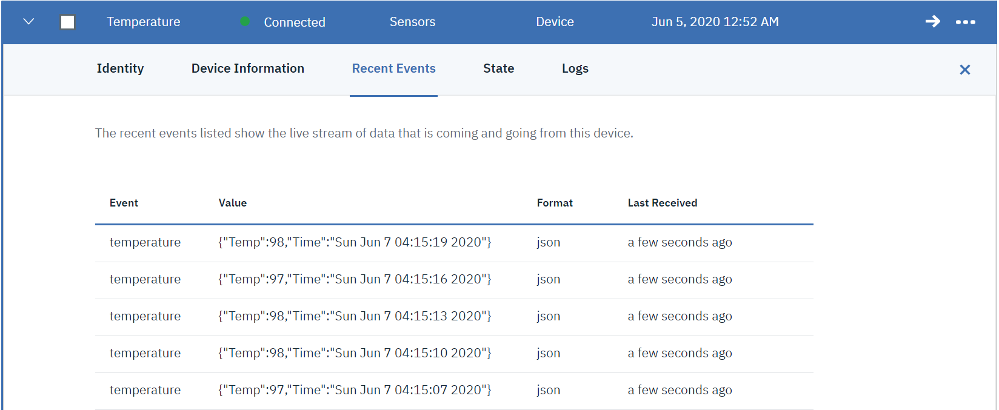

# Nakano
Autonomous Temperature Screener

# Description:
Imagine a world post covid , where you want to step out of the house , grab a coffee or simply go to the office. These were things we took for granted before the mighty COVID struck us and left us to think of a  new normal where wearing a mask, carrying a sanitizer and regular temperature checks are the new normal. Just as after the bomb blasts , metal screeners were installed in public spaces we believe devices like Nakano will normalize temperature checks in a post COVID era.
Traditionally there is a person at the point of entry of a public space like airports , restaurants, office buildings, hotels, that normally screens for temperature with the help of a temperature gun before allowing you in. Our solution Nakano makes it possible for you to autonomously screen for temperature and thus not risking the person or guard at possible infections. Nakano measures human body temperature by collecting infrared thermal radiation from the human forehead. The operation is simple, hygienic and the measurement is fast & accurate. The user only needs to point His/Her forehead in front of the (Infrared sensor) and the human body temperature can be quickly and accurately measured within 0.5 seconds. The products are mainly composed of infrared temperature sensor, signal receiving main control board, Power ON/OFF Switch, buzzer, 7-Segment display etc.

# Circuit

# Product Architecture and Roadmap

## Streaming temperature sensor data to the IOT platform
#### (Data is simulated sensor data in this case)

## IBM Watson IOT Platform  

## Streamed Device data on the IOT platform

## Application listening to IOT device data with relevant console logs 

## Sample User Text Alert

